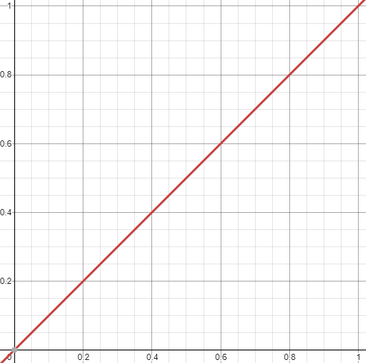
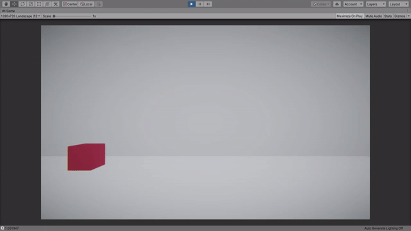
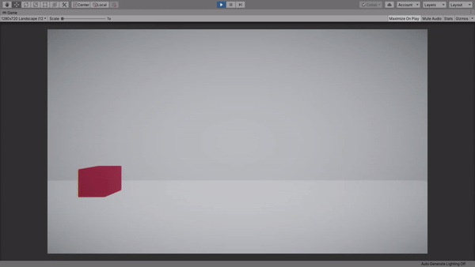
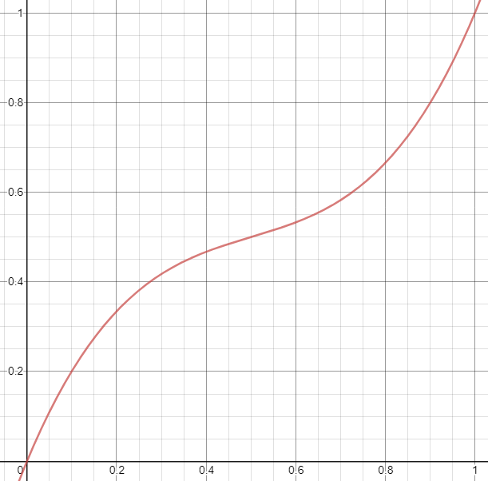

# Interpolation and Bézier curves. Their usage in game development, animation and the creation of smooth transitions from one value to another

## Definition:
---
Interpolation is a mathematical method for finding unknown intermediate values between two or
more specified values.

Interpolation is widely used in animation (especially user interfaces) and 
game development, since it can be used to smoothly change numeric values, such as the 
position or size of an object.

Let's imagine that we need to move an object from point `a` to point `b`.
We can simply set object's position to `b`

``` c#
transform.position = b;
```

But in this case, the transition will be abrupt and unnatural. Interpolation comes to the rescue
which allows you to calculate intermediate values between `a` and `b`, instead of 
manually setting 100 positions between them to make the transition appear smooth.

## Linear interpolation:
---
`a` is our initial value and as a percentage equals 0 and
`b` is our final value and as a precentage equals 1 (i.e. 100%).

Let's designate this percentage value of the variable `t`, which will be in the interval [0.0; 1.0],
where for `t` = 0 the value will correspond to `a`, and for `t` = 1 correspond to `b`.

We can write it down as the following formula:

```
a + (b - a)t
```

Where `a` is the initial value, `b` - is the final value, and `t` - is the value of progress,
which ranges from 0.0 to 1.0, inclusive (i.e., from 0 to 100%)

Let's create a class called `Interpolations`, where we will implement the linear interpolation method

``` c#
public class Interpolations
{
    public static float Linear(float a, float b, float t)
    {
        if (t <= 0)
            return a;
        else if (t >= 1)
            return b;

        return a + (b - a) * t;
    }
}
```

If we call method `Interpolations.Linear(0, 5, 0.5f)`, we get `2.5`,
which is exactly the average value between `a` and `b`.

This is the formula for linear interpolation.

You might be familiar with it if you used the methods in Unity, which are called Lerp 
(stands for Linear Interpolation) and accept the same variables as arguments. Moreover, this formula is equivalent to calling the function `Mathf.Lerp`

This interpolation can be expressed as a regular line on the graph, which is why it is called linear.



## Usage of linear interpolation:
---
Interpolation can be applied to any numeric values, so we can add analog of the function `Vector3.Lerp`, 
which will return linear interpolation between two vectors,
to our `Interpolations` class without any problems

``` c#
public class Interpolations
{
    public static float Linear(float a, float b, float t)
    {
        if (t <= 0)
            return a;
        else if (t >= 1)
            return b;

        return a + (b - a) * t;
    }

    public static Vector3 Linear(
      Vector3 a, 
      Vector3 b, 
      float t)
    {
        if (t <= 0)
            return a;
        else if (t >= 1)
            return b;

        return new Vector3(
          Linear(a.x, b.x, t), 
          Linear(a.y, b.y, t), 
          Linear(a.z, b.z, t)
        );
    }
}
```

Using this linear interpolation function in the `Update` method or inside
`coroutine` you can achieve a smooth movement of the object.

``` c#
private IEnumerator SmoothMove(Vector3 whereToMove)
{
    Vector3 startPosition = transform.position;
    float t = 0.0f;
    while (t < 1.0f)
    {
        transform.position = Interpolations.Linear(
          startPosition, 
          whereToMove, 
          t);
        t += Time.deltaTime;
        yield return null;
    }
}
```

If we call method `StartCoroutine(SmoothMove(new Vector3(4, 0, 0)))`,
and after its execution we take a look at the position of the object in the inspector,
we can notice that the position values don't correspond to the final ones.


Why is it so? Due to the fact that the value of `Time.deltaTime`,
which we add to `t`, is not fixed
`t`,  will most likely not equal 1,
but will stop at a value close to it, for example 0.98976.

To fix this, after the loop, we can manually set final value to our mutable variable

``` c#
private IEnumerator SmoothMove(Vector3 whereToMove)
{
    Vector3 startPosition = transform.position;
    float t = 0.0f;
    while (t < 1.0f)
    {
        transform.position = Interpolations.Linear(
          startPosition, 
          whereToMove, 
          t);
        t += Time.deltaTime;
        yield return null;
    }
    transform.position = whereToMove;
}
```

After these changes, at the end of the movement, the position of the object corresponds to
final values, and we got a smooth animation


Thanks to interpolation, you can smoothly change not only the position of objects,
but any numerical values: size, color, rotation, etc.

For most types in Unity there is a `Lerp` function:  `Vector2`,
`Vector3`, `Color`,
`Quaternion`

## Non-linear types of interpolation:
---

Interpolation is not only linear.
So one of the most popular non-linear interpolation methods is `ease-in-out`
uses the following formula:

### **a - (b - a)t<sup>2</sup>(3 - 2t)**

and can be represented as a transformed cubic parabola


The popularity of this interpolation method is due to the fact that it allows you to reproduce
more realistic movement of the object, when at the beginning of its movement the object is accelerated and
picks up speed, and when stopped, it drops and slows down smoothly, as can be seen on the graph.

The code implementation of this interpolation method will look like this:  

``` c#
public static float EaseInOut(float a, float b, float t)
{
    if (t <= 0)
        return a;
    else if (t >= 1)
        return b;

    return a + (b - a) * t * t * (3.0f - 2.0f * t);
}

public static Vector3 EaseInOut(Vector3 a, Vector3 b, float t)
{
    if (t <= 0)
        return a;
    else if (t >= 1)
        return b;

    return new Vector3(EaseInOut(a.x, b.x, t), EaseInOut(a.y, b.y, t), EaseInOut(a.z, b.z, t));
}
```

Here is an example of moving object`ease-in-out` interpolation


As you can see above, our object first picks up speed and accelerates, and then drops it and slows down.

## Bézier curves:
---

But what if we want to have more flexibility in interpolation control, what if we want
our object was accelerated only at the beginning of the movement, but decelerated sharply or vice versa.
Or at first it would move back, taking acceleration, and only then move to the final position.

Unity has `Animation Curves`, which can be used for this
goals, but I want to show you how to do it without using them so you can better understand
how more complex interpolation works, including `Animation Curves`.

In this case, wonderful Bézier curves come to our rescue, which are used not only in interpolation,
but also, for example, in vector graphics.

Thanks to Bézier curves, we have new arguments that help us control the appearance of our graph.
Depending on the number of arguments, the Bézier curve will be quadratic, cubic, etc.

## Quadratic Bézier interpolation
---

Let's take a look at **quadratic Bézier interpolation** first.

For this, we introduce a new variable `p`, which will help control
the shape of the graph and will be an intermediate variable in interpolation.

Now in order to calculate the result of the interpolation we must first calculate the linear interpolation between `a` and `p`, let it be *q<sub>0</sub>*

Then calculate the linear interpolation between `p` and `b`, let it be *q<sub>1</sub>*

Finally, we must calculate the linear interpolation between *q<sub>0</sub>* and *q<sub>1</sub>*.

This will be the result of the quadratic Bézier interpolation.

This can be written as the following formula:

### **a + (p - a)t = q<sub>0</sub>**<br>
### **p + (b - p)t = q<sub>1</sub>**<br>
### **q<sub>0</sub> + (q<sub>1</sub> - q<sub>0</sub>)t**

If you expand this formula, you get the following:

### **a + (p - a)t + ((p + (b - p)t) - (a + (p - a)t))t**

Let's simplify the resulting expression:

### **a + 2pt - 2at + bt<sup>2</sup> - 2pt<sup>2</sup> + at<sup>2</sup>**

Or in the form suggested by wikipedia:

### **(1 - t)<sup>2</sup>a + 2(1 - t)tp + t<sup>2</sup>b**

This is a quadratic Bézier interpolation that can be represented by various transformations of
parabola, depending on the value of `p`, or a straight line if `p`
equals to the average value between `a` and `b`.

This is how the graph looks like when `p = a`


Thanks to such a graph, you can get smooth acceleration and hard braking.

This is how the graph looks like when `p = b`


Here you can get sharp acceleration and smooth braking.

Implementing quadratic Bézier interpolation in your code would look like this:

``` c#
public static float QuadraticBezier(
  float a, 
  float b, 
  float p, 
  float t)
{
    if (t <= 0)
        return a;
    else if (t >= 1)
        return b;

    float st = t * t;
    return a + 2 * p * t - 2 * a * t + b * st - 2 * p * st + a * st;
}

public static Vector3 QuadraticBezier(
  Vector3 a, 
  Vector3 b, 
  Vector3 p, 
  float t)
{
    if (t <= 0)
        return a;
    else if (t >= 1)
        return b;

    return new Vector3(
      QuadraticBezier(a.x, b.x, p.x, t), 
      QuadraticBezier(a.y, b.y, p.y, t), 
      QuadraticBezier(a.z, b.z, p.z, t));
}
```

Now we can write a method so that our object tends to an additional position before reaching the final

``` c#
private IEnumerator SmoothMoveWithExtraPosition(
  Vector3 whereToMove, 
  Vector3 extraPosition)
{
    Vector3 startPosition = transform.position;
    float t = 0.0f;
    while (t < 1.0f)
    {
        transform.position = Interpolations.QuadraticBezier(
          startPosition, 
          whereToMove, 
          extraPosition, 
          t);
        t += Time.deltaTime;
        yield return null;
    }
    transform.position = whereToMove;
}
```

If we now call `StartCoroutine(SmoothMoveWithExtraPosition(new Vector3(5, 0, 0), new Vector3(0, 5, 0)))`,
then we get an object that will be moving in an arc


Moreover, we can move in the arc precisely because of the curve.
If we tried to do the same, but through 2 separate linear interpolation calls
first to the intermediate top position, and then to the final, then the object would move in a triangle,
not an arc.

We can also make our object pass slightly
final destination and returned to it, calling
`StartCoroutine(SmoothMoveWithExtraPosition(new Vector3(5, 0, 0), new Vector3(8, 0, 0)))`



Agree that with quadratic Bézier interpolation, a lot more possibilities open up for us,
but that's not all. The beauty of Bézier curves is that you can add as many arguments to them,
as you want.

## Cubic Bézier interpolation
---

Let's turn the quadratic Bézier interpolation to cubic.

To do this, instead of one, we will introduce 2 new arguments: *p<sub>1</sub>*, и *p<sub>2</sub>*.

To calculate the result of this interpolation we need:

Calculate linear interpolation between `a` and *p<sub>1</sub>*, let it be *q<sub>0</sub>*

### **a + (p<sub>1</sub> - a)t = q<sub>0</sub>**

Calculate linear interpolation between *p<sub>1</sub>* and *p<sub>2</sub>*, let it be *q<sub>1</sub>*

### **p<sub>1</sub> + (p<sub>2</sub> - p<sub>1</sub>)t = q<sub>1</sub>**

Calculate linear interpolation between *p<sub>2</sub>* and `b`, let it be *q<sub>2</sub>*

### **p<sub>2</sub> + (b - p<sub>2</sub>)t = q<sub>2</sub>**

Now let's calculate the linear interpolation between *q<sub>0</sub>* and *q<sub>1</sub>*, let it be *r<sub>0</sub>*

### **q<sub>0</sub> + (q<sub>1</sub> - q<sub>0</sub>)t = r<sub>0</sub>**

We also calculate the linear interpolation between *q<sub>1</sub>* and *q<sub>2</sub>*, let it be *r<sub>1</sub>*

### **q<sub>1</sub> + (q<sub>2</sub> - q<sub>1</sub>)t = r<sub>1</sub>**

Finally, we get the result of our cubic Bézier interpolation as a linear
interpolation between *r<sub>0</sub>* и *r<sub>1</sub>*

### **r<sub>0</sub> + (r<sub>1</sub> - r<sub>0</sub>)t = сubic Bézier interpolation**

If you expand this formula, you get the following:

### **q<sub>0</sub> + (q<sub>1</sub> - q<sub>0</sub>)t + ((q<sub>1</sub> + (q<sub>2</sub> - q<sub>1</sub>)t) - (q<sub>0</sub> + (q<sub>1</sub> - q<sub>0</sub>)t))t**

Let us expand in more detail:

### **a + (p<sub>1</sub> - a)t + ((p<sub>1</sub> + (p<sub>2</sub> - p<sub>1</sub>)t) - (a + (p<sub>1</sub> - a)t))t + ((p<sub>1</sub> + (p<sub>2</sub> - p<sub>1</sub>)t + ((p<sub>2</sub> + (b - p<sub>2</sub>)t) - (p<sub>1</sub> + (p<sub>2</sub> - p<sub>1</sub>)t))t) - (a + (p<sub>1</sub> - a)t + ((p<sub>1</sub> + (p<sub>2</sub> - p<sub>1</sub>)t) - (a + (p<sub>1</sub> - a)t))t))t**

Simplifying the expression, we get:

### **a + bt<sup>3</sup> - at<sup>3</sup> - 6p<sub>1</sub>t<sup>2</sup> - 3at - 3p<sub>2</sub>t<sup>3</sup> + 3at<sup>2</sup> + 3p<sub>1</sub>t + 3p<sub>1</sub>t<sup>3</sup> + 3p<sub>2</sub>t<sup>2</sup>**

Or as wikipedia suggests:

### **(1 - t)<sup>3</sup>a + 3(1 - t)<sup>2</sup>tp<sub>1</sub> + 3(1 - t)t<sup>2</sup>p<sub>2</sub> + t<sup>3</sup>b**

Cubic Bézier interpolation can be expressed by different transformations of a cubic parabola,
depending on the values of *p<sub>1</sub>* and *p<sub>2</sub>*.

Here is an example of a graph at `a` = 0, `b` = 1, *p<sub>1</sub> = -0.5*, *p<sub>2</sub> = 1.5*


Th  anks to it, you can achieve the effect when the object drives back to accelerate,
moves over the final point and returns to it. 



Here is an example of a graph at `a` = 0, `b` = 1, *p<sub>1</sub> = 0.8*, *p<sub>2</sub> = 0.2*



As you can see the graphs represent a sharper form of `ease-in-out` interpolation

Implementing cubic Bézier interpolation in code would look like this:

```c#
public static float CubicBezier(float a, float b, float p1, float p2, float t)
{
    return (1 - t) * (1 - t) * (1 - t) * a + 3 * (1 - t) * (1 - t) * t * p1 + 3 * (1 - t) * t * t * p2 + t * t * t * b;
}

public static Vector3 CubicBezier(Vector3 a, Vector3 b, Vector3 p1, Vector3 p2, float t)
{
    return new Vector3(
      CubicBezier(a.x, b.x, p1.x, p2.x, t), 
      CubicBezier(a.y, b.y, p1.y, p2.y, t), 
      CubicBezier(a.z, b.z, p1.z, p2.z, t)
    );
}
```

Now we can set up to 2 additional positions along the path of our object.
One of the examples, when the first position was less than  `a`, and the second more than `b`, you can see above.

It is not necessary that the positions differ along one axis only.
Here's a sample code to make our object move along the `z` axis as it moves 

``` c#
private IEnumerator SmoothMoveCubicBezier(Vector3 whereToMove, Vector3 p1, Vector2 p2)
{
    Vector3 startPosition = transform.position;
    float t = 0.0f;
    while (t < 1.0f)
    {
        transform.position = Interpolations.CubicBezier(startPosition, whereToMove, p1, p2);
        t += Time.deltaTime;
        yield return null;
    }

    transform.position = whereToMove;
}
```


It would be possible to continue adding new arguments ad infinitum, but as a rule there is no need for this and
most problems can be solved using a quadratic or cubic Bézier curve.  

## Control over interpolation time and speed:
---
So, thanks to Bezier curves, we learned to control the type of interpolation, but not its time or speed.
Now we are limited to one second, because `t` is in between [0.0; 1.0], but what if we want for the object
to move for 2 seconds or 0.5?

To do this, you can declare the variable `d`, which will be responsible
for the duration of the interpolation. And to keep `t` in the range [0.0; 1.0], we can
divide `t` by `d`, when we pass it to the interpolation function.

In code it will look like this:
``` c#
private IEnumerator Interpolation(float a, float b, float d)
{
    float t = 0.0f;
    while (t < d)
    {
        result = Interpolations.Linear(a, b, t / d);
        t += Time.deltaTime;
        yield return null;
    }

    result = b;
}
```

The interp  olation speed can also be controlled, for this you can declare
a separate variable  `s`, by which we will multiply
`Time.deltaTime`, when we add it to `t`

Implementing interpolation speed in code:
``` c#
private IEnumerator Interpolation(float a, float b, float d, float s)
{
    float t = 0.0f;
    while (t &lt; d)
    {
        result = Interpolations.Linear(a, b, t / d);
        t += Time.deltaTime * s;
        yield return null;
    }

    result = b;
}
```

Now we are able to control both the type of interpolation and its time and speed.

## Summarizing:
<ul>
  <li>
    We learned that interpolation is a mathematical method for finding unknown intermediate
    values between two or more specified values.
  </li>
  <li>
    It is widely used in animation, as it allows you to create smooth transitions,
    for example, from one position to another, etc.
  </li>
  <li>
    Interpolation can be both linear and not
  </li>
  <li>
    One of the most flexible and versatile methods for interpolation is Bézier curves.
    They are obtained as a result of linear interpolation between linear interpolations of final and
    intermediate values. They also allow you to control the appearance of the curve, and as a result control the interpolation itself
  </li>
  <li>
    When adding a non-fixed value to t, the values will not match the final ones,
    but will only be closer to them, to avoid this, you can set the final values separately
  </li>
  <li>
    Interpolation time and speed can be easily controlled
  </li>
</ul>

---
### Thanks for reading!
If you find any errors in the text, you can open an issue or mr in the repository of this text on github or write to me by email: dysncer@gmail.com

### Author of the text and all materials: Denis Yatsenko
* [Github](https://github.com/Dsyncer)
* [Linkedin](https://www.linkedin.com/in/denis-yatsenko-39b746213/)
* Email: dysncer@gmail.com
* [VK](https://vk.com/dsyncer)
* Ethereum wallet address: `0x53F64dfd0a6269E9ff48851E8b41B81287B44b62`

---
Copyright &copy; 2021, Denis Yatsenko.

Most of the original articles and content on my blog is distributed under a [CC-BY 4.0 licence](https://creativecommons.org/licenses/by/4.0/deed.en_US) licence, meaning that you can share, remix, alter, and build upon this content for any purpose, as long as you credit the author of the content. Where content is not distributed under a CC-BY 4.0 licence, this will be indicated clearly. 

