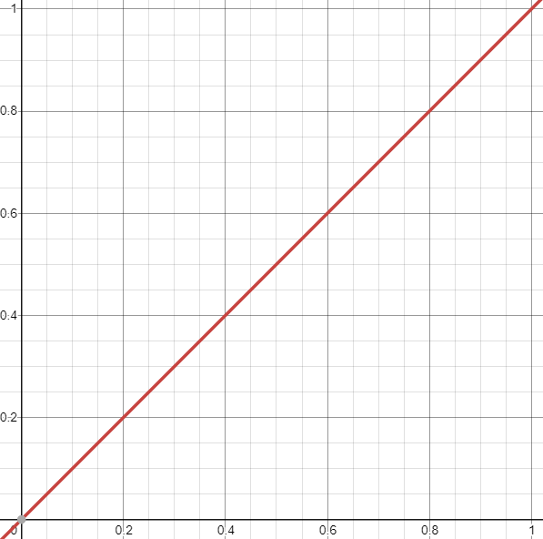
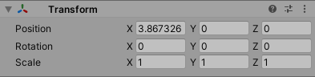
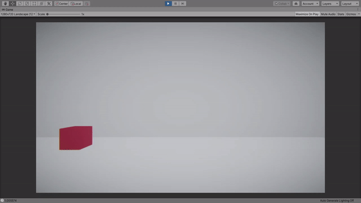
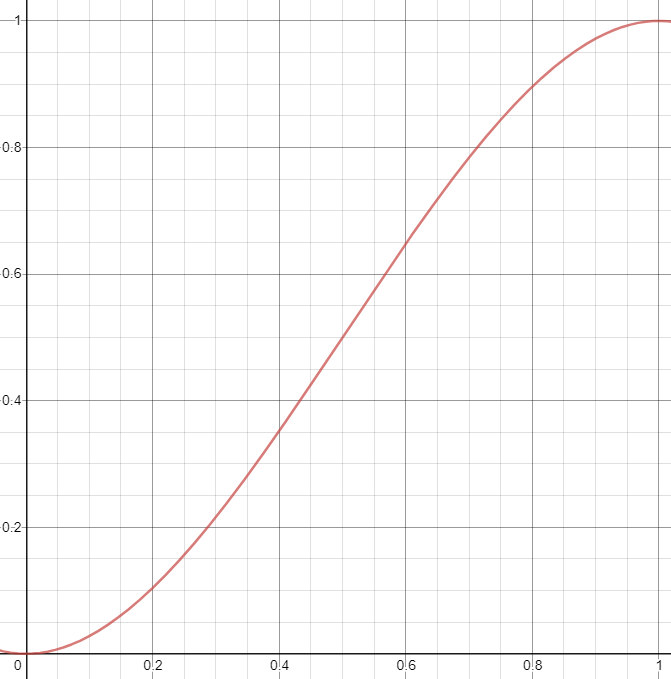
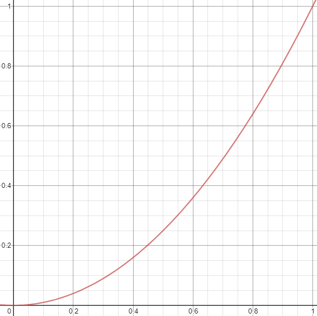
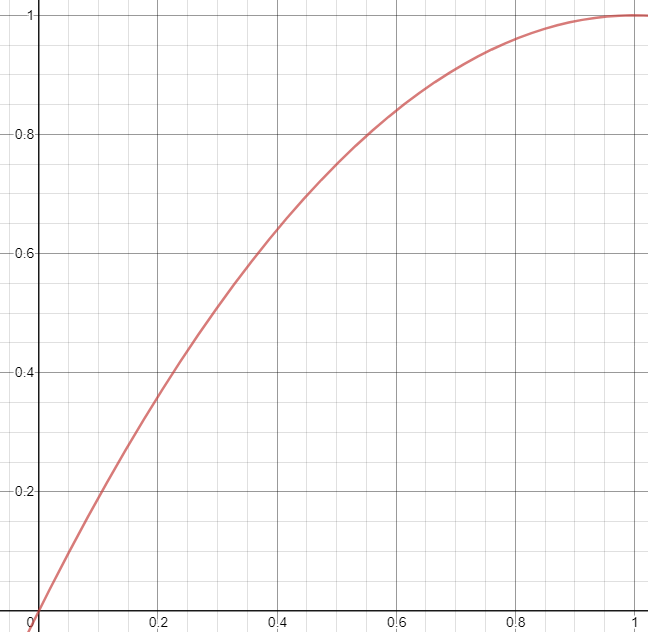
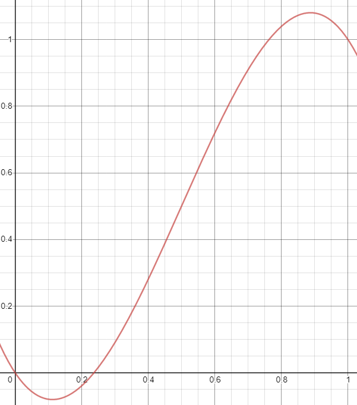
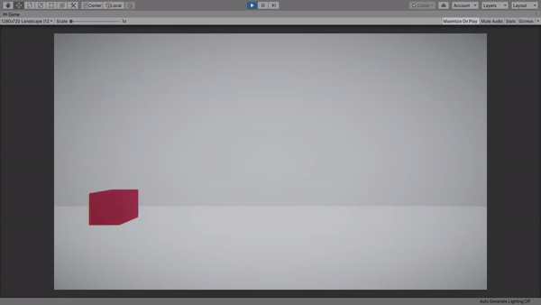
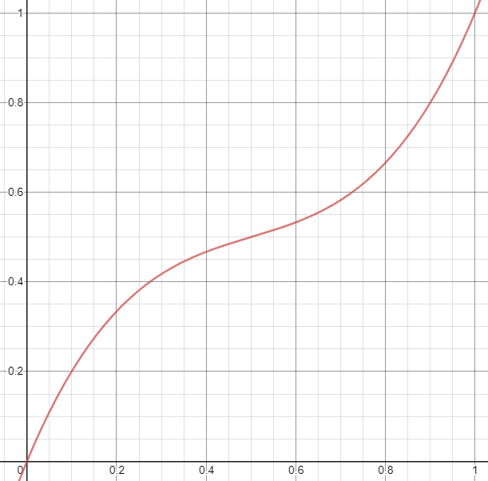

# Интерполяция и кривые Безье. Ее использование в разработке игр, анимации и создание плавных переходов от одних значений к другим

## Определение:
---
Интерполяция это математический метод нахождения неизвестных промежуточных значений между двумя или
более заданными значениями.

Интерполяция нашла широкое применение в анимации
(особенно пользовательских интерфейсов) и разработке игр, так как с её помощью можно плавно менять
числовые значения, например - позицию или размера объекта.

Давайте представим, что нам нужно переместить объект из точки  `a` в точку `b`.
Мы можем просто установить значение позиции объекта позицию `b`

``` c#
transform.position = b;
```

Но в таком случае переход будет резким и неестественным. На помощь приходит интерполяция,
которая позволяет рассчитать промежуточные значения между `a` и `b`, а не задавать,
например, 100 позиций между ними вручную, чтобы переход казался плавным.

## Линейная интерполяция:
---
`a` это наше начальное значение и в процентном соотношении равно 0,
а `b` - финальное значение и равно 1 (т.е. 100%).

Обозначим это процентное значение переменной `t`, которая будет находиться на промежутке [0.0; 1.0],
где при `t` = 0 значение будет соответствовать `a`, а при `t` = 1 соответствовать `b`.

Можем записать это в виде следующей формулы:

```
a + (b - a)t
```

Где `a` - начальное значение, `b` - конечное значение,
а `t` - значение прогресса,
которое находится в пределах от 0 до 1 включительно (т.е. от 0 до 100%).

Давайте создадим класс `Interpolations`, где реализуем метод линейной интерполяции

``` c#
public class Interpolations
{
    public static float Linear(float a, float b, float t)
    {
        if (t <= 0)
            return a;
        else if (t >= 1)
            return b;

        return a + (b - a) * t;
    }
}
```

Если мы вызовем `Interpolations.Linear(0, 5, 0.5f)`, то мы получим `2.5`,
что как раз и является средним значением между `a` и `b`.

Это и есть формула линейной интерполяции.

Вы могли быть знакомы с ней, если пользовались методами в Unity, которые называются Lerp (Расшифровывается, как Linear Interpolation) и принимают
в качестве аргументов те же самые параметры. 
Более того, эта формула равноценна вызову функции `Mathf.Lerp`

Эта интерполяция может быть выражена обычной прямой на графике, поэтому она и называется линейной.



## Применение линейной интерполяции:
---
Интерполяция может быть применена к любым числовым значениям, поэтому мы без проблем можем добавить в наш класс
`Interpolations` аналог функции `Vector3.Lerp`, который будет
возвращать линейную интерполяцию между двумя векторами

``` c#
public class Interpolations
{
    public static float Linear(float a, float b, float t)
    {
        if (t <= 0)
            return a;
        else if (t >= 1)
            return b;

        return a + (b - a) * t;
    }

    public static Vector3 Linear(
      Vector3 a, 
      Vector3 b, 
      float t)
    {
        if (t <= 0)
            return a;
        else if (t >= 1)
            return b;

        return new Vector3(
          Linear(a.x, b.x, t), 
          Linear(a.y, b.y, t), 
          Linear(a.z, b.z, t)
        );
    }
}
```

Используя эту функцию линейной интерполяции в методе `Update` или в
`coroutine` можно добиться плавного передвижения объекта.

``` c#
private IEnumerator SmoothMove(Vector3 whereToMove)
{
    Vector3 startPosition = transform.position;
    float t = 0.0f;
    while (t < 1.0f)
    {
        transform.position = Interpolations.Linear(
          startPosition, 
          whereToMove, 
          t);
        t += Time.deltaTime;
        yield return null;
    }
}
```

Если мы вызовем метод `StartCoroutine(SmoothMove(new Vector3(4, 0, 0)))`,
а после окончания посмотрим на позицию объекта в инспекторе, то можем заметить, что значения позиции не
соответствуют конечным.



Почему же так? Из-за того, что значение `Time.deltaTime`,
которое мы прибавляем к `t` не является фиксированным
`t`, скорее всего, не будет равняться 1,
а остановится на значении близком к нему, например 0.98976.

Чтобы это исправить после цикла можно добавить задание конечного значение нашей изменяемой переменной.

``` c#
private IEnumerator SmoothMove(Vector3 whereToMove)
{
    Vector3 startPosition = transform.position;
    float t = 0.0f;
    while (t < 1.0f)
    {
        transform.position = Interpolations.Linear(
          startPosition, 
          whereToMove, 
          t);
        t += Time.deltaTime;
        yield return null;
    }
    transform.position = whereToMove;
}
```

После этих изменений при окончании движения позиция объекта соответствует
финальным значениям, а мы получили плавную анимацию движения



Благодаря интерполяции можно плавно менять не только позицию объектов, а вообще любые числовые значения: размер, цвет, поворот и т.д.

Для большинства типов в Unity: `Vector2`,
`Vector3`, `Color`,
`Quaternion` и т.д. существует функция `Lerp`
(линейной интерполяции)

## Нелинейные виды интерполяции:
---

Интерполяция бывает не только линейной.
Так один из самых популярных нелинейных методов интерполяции `ease-in-out`
использует следующую формулу:

### **a - (b - a)t<sup>2</sup>(3 - 2t)**

и может быть представлен в виде трансформированной кубической параболы



Популярность этого метода интерполяции связана с тем, что он позволяет воспроизвести
более реалистичное движение объекта, когда в начале своего движение объект ускоряется и
набирает скорость, а при остановке сбрасывает ее и плавно тормозит, что видно на графике.

Реализация этого метода интерполяции в коде будет выглядеть так:

``` c#
public static float EaseInOut(float a, float b, float t)
{
    if (t <= 0)
        return a;
    else if (t >= 1)
        return b;

    return a + (b - a) * t * t * (3.0f - 2.0f * t);
}

public static Vector3 EaseInOut(Vector3 a, Vector3 b, float t)
{
    if (t <= 0)
        return a;
    else if (t >= 1)
        return b;

    return new Vector3(EaseInOut(a.x, b.x, t), EaseInOut(a.y, b.y, t), EaseInOut(a.z, b.z, t));
}
```

Вот пример перемещения объекта с использованием `ease-in-out` интерполяции


Как видно выше наш объект сначала набирает скорость и ускоряется, а затем сбрасывает её и замедляется

## Кривые Безье:
---

Но что если мы хотим иметь больше гибкости в управлении интерполяцией, что если мы хотим, чтобы
наш объект ускорялся только в начале движения, а тормозил резко или наоборот.
Или вообще сначала бы отходил назад, беря разгон, а лишь потом передвигался к конечной позиции.

В Unity есть `Animation Curves`, которые могут быть использованы для этой
цели, но я хочу показать как сделать это без их использование, чтобы вы могли лучше понять,
как работает более сложная интерполяция, в том числе и `Animation Curves`.

В таком случае нам на помощь приходят замечательные кривые Безье, которые используются не только в интерполяции,
но и, например, в векторной графике.

Благодаря кривым Безье у нас появляются новые аргументы, которые помогают нам контролировать вид нашего графика.
В зависимости от количества аргументов кривая Безье будет квадратичной, кубической и т.д.

## Квадтратичная интерполяция Безье
---

Давайте сначала рассмотрим **квадратичную интерполяцию Безье**.

Введем для этого новую переменную `p`, которая поможет контролировать
форму графика и будет являться промежуточной переменной в интерполяции.

Теперь чтобы посчитать результат интерполяции мы должны сначала рассчитать линейную интерполяцию между `a` и `p`,
пусть это будет *q<sub>0</sub>*

Затем рассчитать линейную интерполяцию между `p` и `b`, пусть это будет *q<sub>1</sub>*

И наконец мы должны рассчитать линейную интерполяцию между *q<sub>0</sub>* и *q<sub>1</sub>*.

Это и будет результатом квадратичной интерполяции Безье.

Это можно записать в виде следующей формулы:

### **a + (p - a)t = q<sub>0</sub>**<br>
### **p + (b - p)t = q<sub>1</sub>**<br>
### **q<sub>0</sub> + (q<sub>1</sub> - q<sub>0</sub>)t**

Если расписать эту формулу, то получится следующее:

### **a + (p - a)t + ((p + (b - p)t) - (a + (p - a)t))t**

Упростим полученное выражение:

### **a + 2pt - 2at + bt<sup>2</sup> - 2pt<sup>2</sup> + at<sup>2</sup>**

Или в том виде, который предлагает википедия:

### **(1 - t)<sup>2</sup>a + 2(1 - t)tp + t<sup>2</sup>b**

Это квадратичная интерполяция Безье, которая может быть представлена различными трансформациями
параболы, в зависимости от значения `p`, или прямой в случае, если `p`
равно среднему значению между `a` и `b`.

Вот так выглядит график, при `p = a`



Благодаря такому графику можно получить плавное ускорение и резкое торможение.

Вот так выглядит график, при `p = b`



Тут же наоборот можно получить резкое ускорение и плавное торможение.

Имплементация квадратичной интерполяции Безье в коде будет выглядеть следующим образом:

``` c#
public static float QuadraticBezier(
  float a, 
  float b, 
  float p, 
  float t)
{
    if (t <= 0)
        return a;
    else if (t >= 1)
        return b;

    float st = t * t;
    return a + 2 * p * t - 2 * a * t + b * st - 2 * p * st + a * st;
}

public static Vector3 QuadraticBezier(
  Vector3 a, 
  Vector3 b, 
  Vector3 p, 
  float t)
{
    if (t <= 0)
        return a;
    else if (t >= 1)
        return b;

    return new Vector3(
      QuadraticBezier(a.x, b.x, p.x, t), 
      QuadraticBezier(a.y, b.y, p.y, t), 
      QuadraticBezier(a.z, b.z, p.z, t));
}
```

Теперь можно написать метод для того, чтобы наш объект стремился к дополнительной позиции, прежде чем достичь финальной

``` c#
private IEnumerator SmoothMoveWithExtraPosition(
  Vector3 whereToMove, 
  Vector3 extraPosition)
{
    Vector3 startPosition = transform.position;
    float t = 0.0f;
    while (t < 1.0f)
    {
        transform.position = Interpolations.QuadraticBezier(
          startPosition, 
          whereToMove, 
          extraPosition, 
          t);
        t += Time.deltaTime;
        yield return null;
    }
    transform.position = whereToMove;
}
```

Если мы теперь вызовем `StartCoroutine(SmoothMoveWithExtraPosition(new Vector3(5, 0, 0), new Vector3(0, 5, 0)))`,
то получим объект, который будет описывать дугу в движении:


Причем мы можем описать дугу именно благодаря кривой.
Если бы мы попытались сделать тоже самое, но через 2 отдельных вызова линейной интерполяции
сначала к промежуточной верхней позиции, а затем к финальной, то объект описал бы треугольник,
а не дугу.

Еще мы можем сделать так, чтобы наш объект слегка проезжал
конечное место назначение и возвращался к нему, вызвав
`StartCoroutine(SmoothMoveWithExtraPosition(new Vector3(5, 0, 0), new Vector3(8, 0, 0)))`


Согласитесь, что с квадратичной интерполяцией Безье для нас открывается намного больше возможностей,
но это еще не все. Прелесть кривых Безье в том, что в них можно добавлять столько аргументов,
сколько душе угодно.

## Кубическая интерполяция Безье
---

Давайте превратим квадратичную интерполяцию Безье в кубическую.

Для этого вместо одного введем 2 новых аргумента: *p<sub>1</sub>*, и *p<sub>2</sub>*.

Чтобы посчитать результат этой интерполяции нам нужно:

Рассчитать линейную интерполяцию между `a` и *p<sub>1</sub>*, пусть это будет *q<sub>0</sub>*

### **a + (p<sub>1</sub> - a)t = q<sub>0</sub>**

Рассчитать линейную интерполяцию между *p<sub>1</sub>* и *p<sub>2</sub>*, пусть это будет *q<sub>1</sub>*

### **p<sub>1</sub> + (p<sub>2</sub> - p<sub>1</sub>)t = q<sub>1</sub>**

Рассчитать линейную интерполяцию между *p<sub>2</sub>* и `b`, пусть это будет *q<sub>2</sub>*

### **p<sub>2</sub> + (b - p<sub>2</sub>)t = q<sub>2</sub>**

Теперь рассчитаем линейную интерполяцию между *q<sub>0</sub>* и *q<sub>1</sub>*, пусть это будет *r<sub>0</sub>*

### **q<sub>0</sub> + (q<sub>1</sub> - q<sub>0</sub>)t = r<sub>0</sub>**

Рассчитаем также линейную интерполяцию между *q<sub>1</sub>* и *q<sub>2</sub>*, пусть это будет *r<sub>1</sub>*

### **q<sub>1</sub> + (q<sub>2</sub> - q<sub>1</sub>)t = r<sub>1</sub>**

И наконец получаем результат нашей кубической интерполяции Безье в виде линейной
интерполяции между *r<sub>0</sub>* и *r<sub>1</sub>*

### **r<sub>0</sub> + (r<sub>1</sub> - r<sub>0</sub>)t = кубическая интерполяция Безье**

Если расписать эту формулу, то получится следующее:

### **q<sub>0</sub> + (q<sub>1</sub> - q<sub>0</sub>)t + ((q<sub>1</sub> + (q<sub>2</sub> - q<sub>1</sub>)t) - (q<sub>0</sub> + (q<sub>1</sub> - q<sub>0</sub>)t))t**

Распишем еще подробнее:

### **a + (p<sub>1</sub> - a)t + ((p<sub>1</sub> + (p<sub>2</sub> - p<sub>1</sub>)t) - (a + (p<sub>1</sub> - a)t))t + ((p<sub>1</sub> + (p<sub>2</sub> - p<sub>1</sub>)t + ((p<sub>2</sub> + (b - p<sub>2</sub>)t) - (p<sub>1</sub> + (p<sub>2</sub> - p<sub>1</sub>)t))t) - (a + (p<sub>1</sub> - a)t + ((p<sub>1</sub> + (p<sub>2</sub> - p<sub>1</sub>)t) - (a + (p<sub>1</sub> - a)t))t))t**

Упростив выражение получаем:

### **a + bt<sup>3</sup> - at<sup>3</sup> - 6p<sub>1</sub>t<sup>2</sup> - 3at - 3p<sub>2</sub>t<sup>3</sup> + 3at<sup>2</sup> + 3p<sub>1</sub>t + 3p<sub>1</sub>t<sup>3</sup> + 3p<sub>2</sub>t<sup>2</sup>**

Или как предлагает википедия:

### **(1 - t)<sup>3</sup>a + 3(1 - t)<sup>2</sup>tp<sub>1</sub> + 3(1 - t)t<sup>2</sup>p<sub>2</sub> + t<sup>3</sup>b**

Кубическая интерполяция Безье может быть выражена разными трансформациями кубической параболы,
в зависимости от значения *p<sub>1</sub>* и *p<sub>2</sub>*.

Вот пример графика, при `a` = 0, `b` = 1, *p<sub>1</sub> = -0.5*, *p<sub>2</sub> = 1.5*



Благодаря нему можно добиться эффекта, когда объект отъезжает назад для разгона,
переезжает финальную точку и возвращается на неё.



Вот пример графика, при `a` = 0, `b` = 1, *p<sub>1</sub> = 0.8*, *p<sub>2</sub> = 0.2*



Как можно видеть график представляют собой более резкую форму `ease-in-out` интерполяции

Реализация Кубической интерполяции Безье в коде будет выглядеть следующим образом:

```c#
public static float CubicBezier(float a, float b, float p1, float p2, float t)
{
    return (1 - t) * (1 - t) * (1 - t) * a + 3 * (1 - t) * (1 - t) * t * p1 + 3 * (1 - t) * t * t * p2 + t * t * t * b;
}

public static Vector3 CubicBezier(Vector3 a, Vector3 b, Vector3 p1, Vector3 p2, float t)
{
    return new Vector3(
      CubicBezier(a.x, b.x, p1.x, p2.x, t), 
      CubicBezier(a.y, b.y, p1.y, p2.y, t), 
      CubicBezier(a.z, b.z, p1.z, p2.z, t)
    );
}
```

Теперь мы можем задать до 2 дополнительных позиций на пути нашего объекта.
Один из примеров, когда первая позиция была меньше `a`, а вторая больше `b`, вы могли видеть выше.

Необязательно, чтобы позиции разнились только по одной оси.
Вот пример кода, чтобы наш объект петлял по оси `z`, во время движения

``` c#
private IEnumerator SmoothMoveCubicBezier(Vector3 whereToMove, Vector3 p1, Vector2 p2)
{
    Vector3 startPosition = transform.position;
    float t = 0.0f;
    while (t < 1.0f)
    {
        transform.position = Interpolations.CubicBezier(startPosition, whereToMove, p1, p2);
        t += Time.deltaTime;
        yield return null;
    }

    transform.position = whereToMove;
}
```


Можно было бы и дальше добавлять новые аргументы до бесконечности, но как правило в этом нет нужды и
большинство задач могут быть решены при помощи квадратичной или кубической кривой Безье.

## Контроль над временем и скоростью интерполяции:
---
Итак, благодаря кривым Безье мы научились контролировать вид интерполяции, но неё время
или скорость. Сейчас мы ограничены одной секундой, т.к. `t` находится на промежутке [0.0; 1.0], но что если мы хотим,
чтобы объект двигался 2 секунды или 0.5?

Для этого можно ввести переменную `d`, которая будет ответственна
за длительность интерполяции. А для того, чтобы `t` по прежнему была в диапазоне [0.0; 1.0], мы можем
разделить `t` на `d`, когда будем передавать её функции интерполяции.

В коде это будет выглядеть так:
``` c#
private IEnumerator Interpolation(float a, float b, float d)
{
    float t = 0.0f;
    while (t < d)
    {
        result = Interpolations.Linear(a, b, t / d);
        t += Time.deltaTime;
        yield return null;
    }

    result = b;
}
```

Скорость интерполяции точно также можно контролировать, для этого
можно ввести отдельную переменную `s`, на которую мы будем умножать
`Time.deltaTime`, когда будем прибавлять его к `t`

Реализация скорости интерполяции в коде:
``` c#
private IEnumerator Interpolation(float a, float b, float d, float s)
{
    float t = 0.0f;
    while (t &lt; d)
    {
        result = Interpolations.Linear(a, b, t / d);
        t += Time.deltaTime * s;
        yield return null;
    }

    result = b;
}
```

Теперь мы умеем контролировать, как тип интерполяции, так и её время и скорость.

## Итог:
<ul>
  <li>
      Мы узнали, что интерполяция это математический метод нахождения неизвестных промежуточных 
      значений между двумя или более заданными значениями.
  </li>
  <li>
      Она широко используется в анимации, так как позволяет создавать плавные переходы, 
      например, от одной позиции к другой и т.д.
  </li>
  <li>
      Интерполяции может быть как линейной, так и нет 
  </li>
  <li>
      Один из самых гибких и универсальных методов для интерполяции это кривые Безье, 
      которую получаются в результате линейной интерполяции между линейными интерполяциями конечных и 
      промежуточных значений. Также они позволяют контролировать вид кривой, а вследствие и интерполяции
  </li>
  <li>
      При добавлении не фиксированного значения к t значения не будут соответствовать финальным, 
      а будут лишь приближены к ним, чтобы избежать этого можно задать финальные значения отдельно
  </li>
  <li>
      Время и скорость интерполяции легко можно контролировать
  </li>
</ul>

---
### Спасибо за прочтение!
Если вы обнаружили какие-то ошибки в тексте, то можете открыть issue или mr в репозитории этого текста на github или написать мне на почту: dysncer@gmail.com

### Автор текста и всех материалов: Денис Яценко
* [Github](https://github.com/Dsyncer)
* [Linkedin](https://www.linkedin.com/in/denis-yatsenko-39b746213/)
* Email: dysncer@gmail.com
* [VK](https://vk.com/dsyncer)
* Ethereum wallet address: `0x53F64dfd0a6269E9ff48851E8b41B81287B44b62`

---
Copyright &copy; 2021, Denis Yatsenko.

Most of the original articles and content on my blog is distributed under a [CC-BY 4.0 licence](https://creativecommons.org/licenses/by/4.0/deed.en_US) licence, meaning that you can share, remix, alter, and build upon this content for any purpose, as long as you credit the author of the content. Where content is not distributed under a CC-BY 4.0 licence, this will be indicated clearly. 

